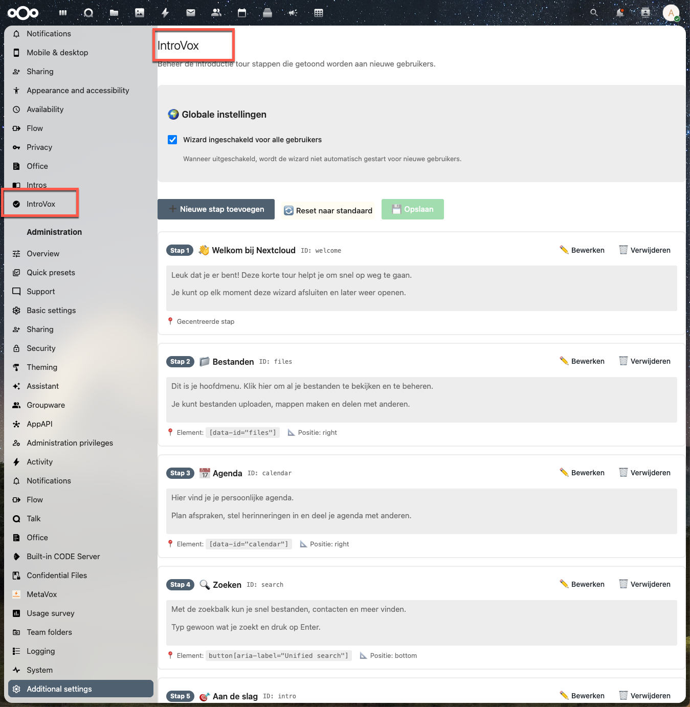

# Administrator Guide

This guide describes day-to-day administration of IntroVox. For installation, see the [Installation Guide](../deployment/installation.md).

> The screenshot above shows the pre-1.7.0 admin UI with the per-language checkbox grid. The 1.7.0 layout drops that grid in favour of an override-picker on the Steps tab; the rest of the screen is unchanged. Updated screenshots will land in a follow-up.

## Overview

IntroVox is an interactive onboarding wizard that helps new Nextcloud users discover key features through a guided tour. As an administrator, you control:

- **Global wizard availability** — turn the tour on or off for everyone
- **Per-language overrides** — optionally replace the auto-translated default copy with custom text for specific languages
- **Step management** — add, edit, delete, reorder, and enable/disable individual steps
- **Group-based visibility** — restrict specific steps to certain user groups (role-based onboarding)
- **User overrides** — force-show the tour to all users, even those who disabled it

## Accessing Administrator Settings

1. Click your **user avatar** in the top right
2. Select **Settings** (⚙️)
3. Scroll down the left sidebar to **Administration**
4. Click **IntroVox**

You're now on the IntroVox administration page.

## Admin Interface Layout

The admin interface consists of three main sections:

### 1. Global Settings

- **Enable wizard for all users** — master on/off toggle ([Settings](settings.md))
- **Show wizard to all users** — force-show button that clears all user preferences
- Read-only counter of the number of languages that currently have an admin override

### 2. Language Selector (Steps tab)

- Dropdown lists English plus every language that currently has an admin override
- **+ Add language override** — searchable picker over the full Nextcloud language list; switches the editor to that language seeded with the current default copy. No DB row is written until you save
- Switches the step list to the chosen language's override configuration

### 3. Step Management

- **Add step** — create new wizard steps
- **Edit / Delete** — modify or remove existing steps
- **Drag handle** — reorder steps
- **Enable/disable toggle** — temporarily hide steps without deleting
- **Export / Import** — share configurations as JSON ([Import/Export](import-export.md))
- **Reset** — delete the current language's override row; the next request serves the auto-translated defaults straight from Transifex
- **Save changes** — persist all modifications

See [Managing Wizard Steps](managing-steps.md) for details.

## End User Experience

### Automatic Start

When the wizard is enabled:

- New users see the wizard automatically on first login, in their Nextcloud language
- The wizard starts on the dashboard page
- Users can close the wizard anytime with **✕** or **Skip and don't show again**

IntroVox detects the user's Nextcloud language and serves the matching translated default copy, or — if you authored one — the admin override for that language. When neither a Transifex translation nor an admin override exists for the user's language, the wizard falls back to English defaults.

### Manual Start

Users can restart the wizard from **Personal Settings → IntroVox → Restart tour now**, then refresh the page.

### Behavior When the Wizard Is Disabled

If you disable the wizard globally:

- Users do **not** see the wizard automatically
- In their personal settings they see: "The introduction tour is currently disabled by your administrator."
- They cannot start the wizard manually

## Force-Showing the Wizard

The **Show wizard to all users** button resets the wizard for **all users**, including:

- Users who already completed the wizard
- Users who permanently disabled it in personal settings

Use this when:

- A major Nextcloud upgrade adds features worth highlighting
- You significantly updated wizard content
- An important company announcement needs broad visibility

> **Warning:** This overrides all user preferences. Users who explicitly opted out will see the wizard on their next login.

## Next Steps

- [Settings reference](settings.md) — every admin option in detail
- [Managing Wizard Steps](managing-steps.md) — step CRUD and reordering
- [Group-Based Visibility](group-visibility.md) — role-based onboarding (v1.2.0+)
- [Import/Export](import-export.md) — share configurations
- [Best Practices](best-practices.md) — content guidelines
- [Troubleshooting](troubleshooting.md) — common issues
- [FAQ](faq.md) — frequently asked questions
