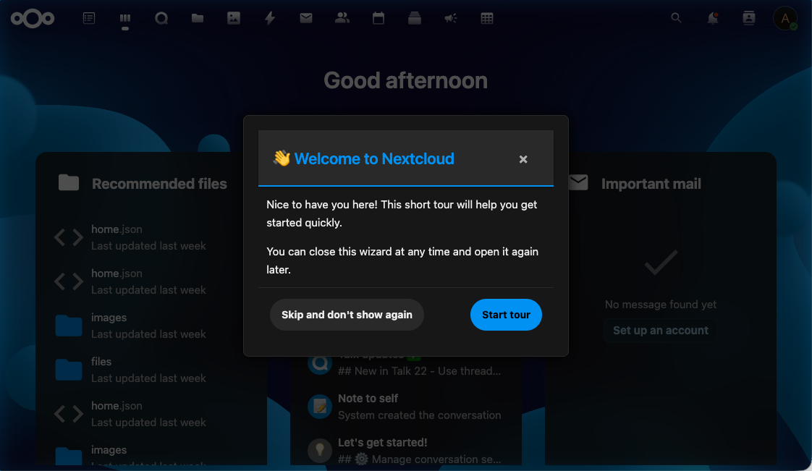

# Thema-ondersteuning

IntroVox past zich automatisch aan aan alle Nextcloud-thema's. Geen configuratie nodig.

## Ondersteunde thema's

- ✅ **Light-modus** (default)
- ✅ **Dark-modus** (via systeem-voorkeur of Nextcloud-instelling)
- ✅ **Hoog-contrast-modus** (toegankelijkheid)
- ✅ **Custom thema's** (via de Nextcloud-Theming-app)

## Hoe het werkt

De wizard gebruikt Nextcloud's CSS-variabelen in plaats van hardcoded kleuren:

| Variabele | Doel |
|---|---|
| `--color-main-background` | Stap-achtergrond |
| `--color-main-text` | Body-tekst |
| `--color-primary-element` | Accent (knoppen, highlight-randen) |
| `--color-border` | Stap-container-rand |
| `--color-background-hover` | Hover-staten op knoppen |

Omdat deze variabelen scoped zijn aan het document en geüpdatet worden door het Nextcloud-theming-systeem, pakt de wizard automatisch elke thema-wijziging op — inclusief custom thema's gedeployed via de Theming-app.

## Toegankelijkheid

### Beperkte beweging

Als de "reduce motion"-toegankelijkheidsvoorkeur van het systeem van de gebruiker is ingeschakeld, schakelt IntroVox zijn animaties uit (stap-overgangen, fade-ins, overlay-tweens).

### Hoog contrast

In hoog-contrast-modus gebruikt de wizard verbeterde rand-diktes en kleur-contrasten om leesbaar te blijven.

### Toetsenbord-focus

Alle interactieve elementen hebben zichtbare focus-indicators die zich aanpassen aan het huidige thema — ze blijven duidelijk zichtbaar in zowel light- als dark-modus.

### Semantische HTML en ARIA

Stappen gebruiken semantische HTML (`<h2>` voor titels, `<button>` voor acties) en ARIA-labels waar nodig, zodat screenreaders content correct kunnen aankondigen.

## Custom CSS

IntroVox ondersteunt momenteel geen custom-CSS-overrides via het admin-paneel. Als je custom styling nodig hebt, kun je:

- De Nextcloud-Theming-app gebruiken om globale CSS-variabelen aan te passen (wijzigingen gelden automatisch voor IntroVox)
- Custom CSS deployen op Nextcloud-niveau (via de "Custom CSS"-feature van de Theming-app)

Vermijd inline-styles binnen stap-HTML — die breken thema-overerving.

## Zie ook

- [Customization](customization.md) — HTML, CSS-selectors, positionering
- [Toetsenbord-navigatie](../user/keyboard-navigation.md) — toegankelijkheids-features voor gebruikers
- [Architectuur-overzicht](../architecture/overview.md) — hoe de frontend integreert met Nextcloud-theming
