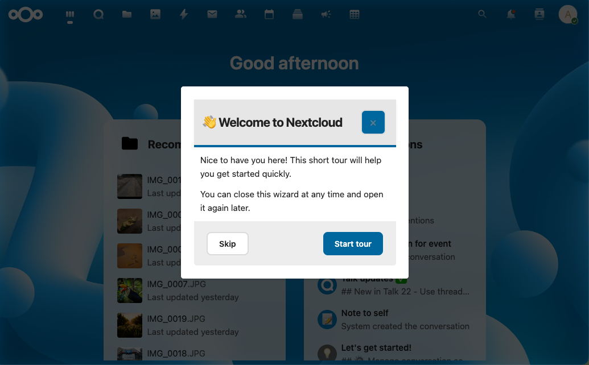

# IntroVox documentatie

Welkom bij de IntroVox-documentatie. IntroVox is een Nextcloud-app die een interactieve onboarding-tour geeft aan nieuwe gebruikers — gebouwd met Vue 3 en Shepherd.js, met meertalige ondersteuning, groep-gebaseerde stap-zichtbaarheid en een volledige beheerderinterface voor configuratie.

*Een stapsgewijze geleide tour door de hoofdfeatures van Nextcloud, volledig aanpasbaar per taal.*

## Snelle navigatie

### Voor gebruikers

Leer hoe je de tour volgt, herstart en je persoonlijke voorkeuren beheert.

- [Overzicht](user/overview.md) — Wat is IntroVox en hoe werkt de tour
- [De tour doorlopen](user/taking-the-tour.md) — Stappen doorlopen, gemarkeerde elementen, centered vs. attached
- [Persoonlijke instellingen](user/personal-settings.md) — Herstarten, permanent uitschakelen, taal-meldingen
- [Toetsenbordnavigatie](user/keyboard-navigation.md) — Sneltoetsen en toegankelijkheid
- [Mobiele ervaring](user/mobile.md) — Responsive layout, touch-interacties
- [Problemen oplossen](user/troubleshooting.md) — Tour start niet, ontbrekende stappen, taalproblemen
- [FAQ](user/faq.md) — Veelgestelde gebruikersvragen
- [Tips](user/tips.md) — Het meeste halen uit Nextcloud

### Voor beheerders

Installatie, configuratie, stappenbeheer en operations.

- [Beheergids](admin/guide.md) — Dagelijks beheer
- [Instellingen](admin/settings.md) — Referentie voor het admin-paneel
- [Talenbeheer](admin/language-management.md) — Talen in/uitschakelen, per-taal configuratie
- [Wizard-stappen beheren](admin/managing-steps.md) — CRUD, ordering, in/uitschakelen, reset naar standaard
- [Groep-gebaseerde zichtbaarheid](admin/group-visibility.md) — Rol-gebaseerde onboarding met groepsfilters
- [Import / Export](admin/import-export.md) — Configuraties delen tussen instances
- [Best practices](admin/best-practices.md) — Contentrichtlijnen, taalstrategie, onderhoud
- [Problemen oplossen](admin/troubleshooting.md) — Wizard verschijnt niet, ontbrekende stappen, vertalingen
- [FAQ](admin/faq.md) — Veelgestelde beheerdersvragen

### Features

Per-feature documentatie voor mogelijkheden.

- [Geleide tours](features/guided-tours.md) — Shepherd.js-engine, staptypen, attached vs. centered
- [Meertalige ondersteuning](features/multi-language.md) — Transifex-integratie, auto-detectie, per-taal stappen
- [Zichtbaarheid van stappen](features/step-visibility.md) — Groepsfilters en gebruikersvoorkeuren
- [Customization](features/customization.md) — HTML in stapinhoud, CSS-selectors, positionering
- [Thema-ondersteuning](features/theme-support.md) — Light, dark, high contrast, custom Nextcloud-thema's

### Voor architecten & ontwikkelaars

Technische documentatie voor integratie, evaluatie en bijdragen.

- [Architectuuroverzicht](architecture/overview.md) — Systeemontwerp en componenten
- [API-referentie](architecture/api-reference.md) — REST API-endpoints
- [Frontend-architectuur](architecture/frontend-architecture.md) — Vue 3 + Shepherd.js-structuur
- [Backend-architectuur](architecture/backend-architecture.md) — Controllers, services, configuratie-opslag
- [Transifex-integratie](architecture/transifex-integration.md) — Vertaling-workflow

### Deployment

Installatie, App Store-publicatie en releaseproces.

- [Installatie](deployment/installation.md) — Installeren vanuit App Store of source
- [App Store-publicatie](deployment/app-store-submission.md) — Certificaat, packaging, signing, uploaden
- [Releaseproces](deployment/release-process.md) — Versie-sync, build, GitHub-releases

## Aan de slag

Nieuw bij IntroVox? Begin met de [Aan de slag-gids](getting-started.md) voor een rol-gebaseerde quickstart.

## Support

- **Issues & feature requests**: [GitHub Issues](https://github.com/nextcloud/IntroVox/issues)
- **Broncode**: [GitHub-repository](https://github.com/nextcloud/IntroVox)

## Licentie

IntroVox is gelicenseerd onder de [AGPL-3.0-licentie](https://www.gnu.org/licenses/agpl-3.0.html).
