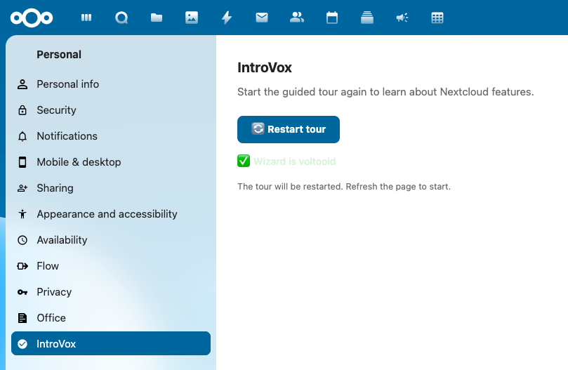

# Persoonlijke instellingen

Je kunt je IntroVox-tour-voorkeuren op elk moment beheren via je persoonlijke instellingen.



## Je IntroVox-instellingen openen

1. Klik op je **profielfoto** of **gebruikersnaam** rechtsboven
2. Selecteer **Persoonlijke instellingen**
3. Scroll naar beneden in de linker-sidebar en klik op **IntroVox**

## Beschikbare opties

In je persoonlijke instellingen kun je:

- **De tour herstarten** — bekijk de begeleide tour opnieuw
- **De tour permanent uitschakelen** — toon hem nooit meer, ook niet na updates

## De tour herstarten

### Methode 1 — vanuit persoonlijke instellingen

1. Navigeer naar **Persoonlijke instellingen → IntroVox**
2. Klik op **🔄 Tour nu herstarten**
3. Je wordt naar het dashboard geleid
4. De tour start automatisch

### Methode 2 — browser-console (geavanceerd)

1. Druk op **F12** om Developer Tools te openen
2. Ga naar het **Console**-tabblad
3. Typ:

   ```js
   window.introVox.start()
   ```

4. Druk op **Enter**

Dit werkt alleen wanneer je al ingelogd bent en op een Nextcloud-pagina staat.

### Wanneer herstarten

- Na een grote Nextcloud-update (er kunnen nieuwe features aan de tour zijn toegevoegd)
- Wanneer je Nextcloud leert voor een project of nieuwe rol
- Om je kennis op te frissen na een tijdje geen Nextcloud te hebben gebruikt
- Om Nextcloud te tonen aan een collega of vriend

## De tour permanent uitschakelen

Als je de tour nooit meer automatisch wilt zien, heb je drie opties:

### Vanuit de welkom-stap

- Klik in de eerste stap op **Overslaan en niet meer tonen**
- De tour wordt permanent uitgeschakeld en sluit direct

### Vanuit persoonlijke instellingen

1. **Persoonlijke instellingen → IntroVox**
2. Vink **"Introductie-tour permanent uitschakelen"** aan
3. Klik op **💾 Instellingen opslaan**

### Door de tour te voltooien

Door op **Klaar** te klikken in de laatste stap, wordt de permanent-uitschakelen-voorkeur ook gezet.

> **Let op:** zelfs na permanent uitschakelen kun je de tour nog steeds handmatig herstarten via **Persoonlijke instellingen → IntroVox**. "Permanent uitschakelen" geldt alleen voor het automatisch starten. Je beheerder kan de tour ook geforceerd tonen aan iedereen, inclusief gebruikers die hem hebben uitgeschakeld.

## Tijdelijk negeren

Als je het druk hebt en de tour voor nu wilt overslaan zonder hem permanent uit te schakelen:

- Klik op **✕** rechtsboven
- De tour sluit, maar verschijnt opnieuw bij de volgende login

Dit is handig als je onderbroken wordt en hem later wilt afronden.

## "Tour niet beschikbaar"-berichten

Je kunt in plaats van de herstart-knop een van deze berichten zien in persoonlijke instellingen:

### "De introductie-tour is momenteel uitgeschakeld door je beheerder"

Je Nextcloud-beheerder heeft de tour voor alle gebruikers uitgezet. Neem contact op met je beheerder als je hem alsnog wilt zien.

### "De introductie-tour is niet beschikbaar in je taal"

Je taal is niet ingeschakeld door je beheerder. IntroVox ondersteunt Engels, Nederlands, Duits, Deens, Frans en Zweeds out-of-the-box, en beheerders kunnen nieuwe talen toevoegen via Transifex-vertalingen. Neem contact op met je beheerder om je taal in te schakelen.

## Zie ook

- [De tour doorlopen](taking-the-tour.md) — hoe je door de tour navigeert
- [Problemen oplossen](troubleshooting.md) — als dingen niet werken
- [FAQ](faq.md) — veelgestelde vragen
